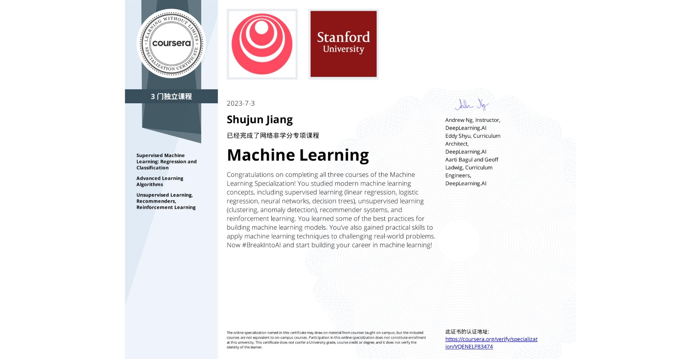
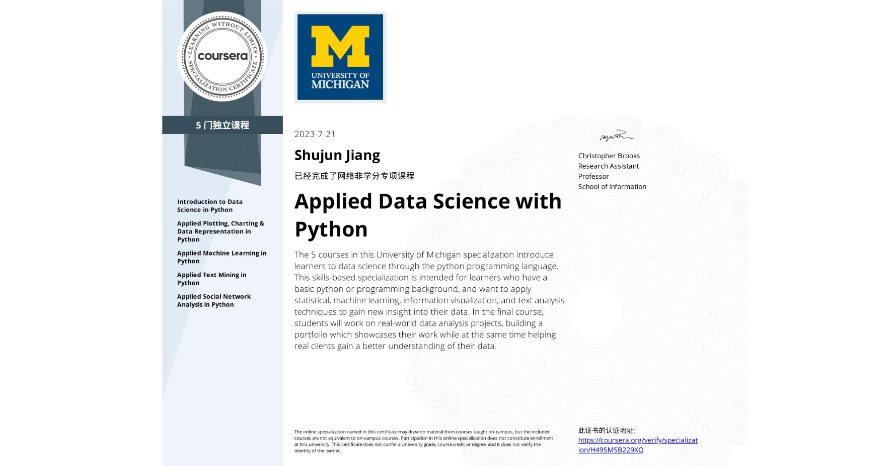
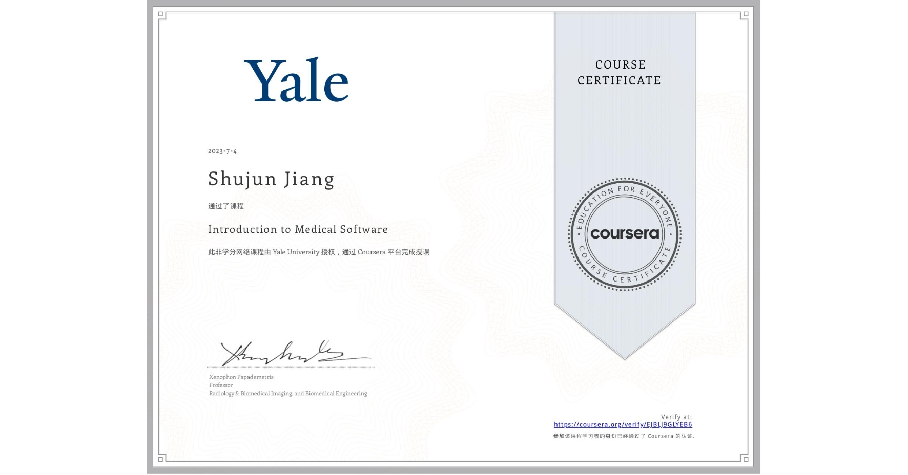

# Welcome to My GitHub Page! 欢迎来到我的 GitHub 主页！ - 👋 Hi

## About Me | 关于我 

Hello! I'm MF-Jiang, a student passionate about coding and open-source projects. I'm thrilled to have you visit my GitHub page. Here, I'll be sharing some insights about programming, development technologies, and other interesting projects.

你好！我是秋绿，一个热爱编程和开源项目的学生。非常高兴您来到我的 GitHub 主页。在这里，我将分享一些关于编程、开发技术和其他有趣的项目。

## Personal Introduction | 个人介绍 

- 👀 I am an Undergraduate student from China. | 来自中国本科
- 🌱 I’m learning Computer Science with Artificial Intelligence in University of Nottingham Ningbo China. | 现就读于宁波诺丁汉大学计算机与人工智能
- 💞️ I'm eager to be stronger. | 变得更强
- 😄 I'm a huge anime fan, and I have to say "Dangerous Thing in My Heart" this April was really good! Hahaha. | 我是二次元，不得不说今年四月的《我心里危险的东西》真好看呀，哈哈哈。

<table>
  <tr>
    <td>
      
    </td>
    <td>
      
    </td>
  </tr>
</table>

## Tech Stack | 技术栈

Throughout my development journey, I've acquired expertise in the following tech stack:

在我的开发旅程中，我掌握了以下技术栈：

- Programming Languages| 编程语言: Python, JavaScript, Java, C\C++, C#
- Front-end Development | 前端开发: HTML, CSS, React
- Back-end Development | 后端开发: Node.js, Django, Spring Boot, Flask
- Databases| 数据库: MySQL, MongoDB, SQLite, SQL Server
- Tools & Frameworks | 工具和框架: Git, Docker, Vue.js, Taro

## Courses Taken | 学习过的课程

<table>
  <tr>
    <td>
      
    </td>
    <td>
      
    </td>
    <td>
      
    </td>
  </tr>
</table>

## Contact Me | 联系方式  

If you're interested in my projects or have any questions, suggestions, or collaboration opportunities, feel free to get in touch with me.
如果您对我的项目或有任何问题、建议或合作机会感兴趣，请随时与我联系。
- 📫 My email is shujun2002@outlook.com | 我的邮箱是shujun2002@outlook.com

|  |  |  |
| ------------- | ------------- | ------------- |

 

Thank you very much for your attention and support! Thank you! 🙏

非常感谢您的关注和支持！谢谢！🙏

